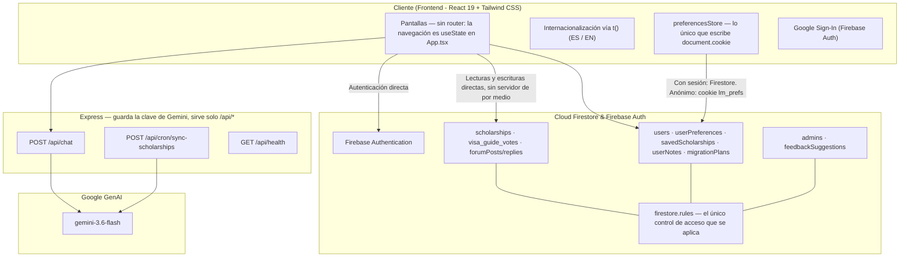

# LatinoMigra 🌍🎓

[](https://github.com/users/ana-izaguirre/projects/4)
[](./LICENSE)
[](https://github.com/ana-izaguirre/latino-migra/actions/workflows/ci.yml)
[](https://github.com/ana-izaguirre/latino-migra/actions/workflows/ci.yml)
[](https://vercel.com/)
[](https://react.dev/)
[](https://firebase.google.com/)
[](https://ai.google.dev/)
[](https://vitest.dev/)
[](https://playwright.dev/)

> **Idiomas / Languages:** **Español 🇪🇸** | [English 🇬🇧](./README.md)

> ⚠️ **Estado: en desarrollo activo.** El producto ya es usable, pero sigue
> cambiando: las pantallas, la forma de los datos y las reglas de Firestore
> todavía no son estables. El trabajo se sigue issue por issue en el
> [tablero del proyecto **Product Engineering**](https://github.com/users/ana-izaguirre/projects/4),
> que es la hoja de ruta: qué está en cola, en curso y terminado. Las issues
> abiertas están en [Issues](https://github.com/ana-izaguirre/latino-migra/issues).

---

## 🇪🇸 Descripción del Proyecto

**LatinoMigra** es una plataforma web integral diseñada para estudiantes y profesionales latinoamericanos que desean migrar a España, Europa o Norteamérica para cursar estudios de grado, máster, cursos de idiomas o formación técnica.

### 🚀 Qué está en pantalla hoy

El producto se ha estrechado a propósito. Seis pantallas existen en el árbol y
siguen compilando, pero nada en la navegación enlaza a ellas — la fuente de
verdad es `HIDDEN_TABS` en
[`src/lib/navigation.ts`](./src/lib/navigation.ts), y restaurar una es borrar
una línea ahí.

| Pantalla | Estado | Qué hace |
| :--- | :--- | :--- |
| **Becas y Estudios** | ✅ En vista | Convocatorias verificadas y programas de estudio, filtrados por origen, destino y nivel (Fundación Carolina, DAAD, Erasmus+, AUIP, Santander). Los guardados se separan en sus propias sub-pestañas. |
| **Guías migratorias** | ✅ En vista | Guías de visado por país, con requisitos, costes y enlaces a la fuente consular oficial. |
| **Asistente IA** | 🚧 En desarrollo | Gemini detrás de un proxy en el servidor, respondiendo sobre visados, seguros, homologaciones y coste de vida. Es alcanzable, pero se sigue trabajando en él. |
| Calculadora de presupuesto | ⛔ Sin enlazar | Alojamiento, alimentación, transporte y seguro mensuales por ciudad. |
| Planificador migratorio | ⛔ Sin enlazar | Hoja de ruta paso a paso antes, durante y después del viaje. |
| Comunidad y foros | ⛔ Sin enlazar | Hilos sobre Firestore, con paginación por cursores y detección de duplicados. |
| Directorio de consulados | ⛔ Sin enlazar | Consulados y embajadas, con enlaces a la cita oficial. |
| Voluntariados | ⛔ Sin enlazar | Plazas de voluntariado e intercambio. |
| Sugerencias | ⛔ Sin enlazar | Propuestas de lectores pendientes de verificar. |

Todo lo marcado con ⛔ está construido pero no se ofrece, así que esta tabla —y
no el árbol de archivos— es la respuesta a "qué puede usar realmente un
visitante".

---

## 🏗️ Arquitectura Técnica



El navegador habla con Firestore directamente, así que `firestore.rules` es el
único control de acceso que se aplica: no hay capa de validación en servidor.
En producción Express sirve solo `/api/*`; el HTML y los assets vienen del CDN
de Vercel. Detalles en [`docs/architecture.md`](./docs/architecture.md).

---

## 🛠️ Cómo se construyó

El proyecto pasó de imagen a producto en tres etapas, y la herramienta cambió
en cada una.

**1. Prototipado — Google Stitch.** Las primeras pantallas se generaron como
prototipos en [Google Stitch](https://stitch.withgoogle.com/), que fijó la
maquetación, la navegación y el lenguaje visual antes de que existiera ningún
componente. Nada de Stitch llega a producción: decidió qué construir.

**2. Primera implementación — Google AI Studio.** Los prototipos se
convirtieron en una aplicación React funcionando con
[Google AI Studio](https://aistudio.google.com/). Esa etapa también fijó el
runtime que el producto sigue usando: Gemini detrás de un proxy en el servidor,
de modo que la clave de API nunca llega al navegador.

**3. Ingeniería continua — Claude como asistente de código.** Las funcionalidades,
las refactorizaciones, las pruebas y las revisiones se hacen con
[Claude](https://claude.ai/code), que es quien firma la mayoría de los commits
de este repositorio. Cada cambio sigue abriéndose como pull request y se revisa
antes de integrarse.

### Context engineering, no prompting

Lo que hace viable la etapa 3 es el **context engineering**: el contexto del
asistente es una parte mantenida del repositorio, no algo que se reescribe en
un chat en cada sesión.

| Dónde vive el contexto | Qué contiene |
| :--- | :--- |
| [`CLAUDE.md`](./CLAUDE.md) | El manual de operación: restricciones no negociables, flujo de trabajo, definición de terminado. Solo reglas; no explica cómo funciona el sistema. |
| [`docs/`](./docs/README.md) | Cómo funciona el sistema realmente, separado por materia: arquitectura, datos, seguridad, pruebas, accesibilidad, despliegue. |
| [`specs/`](./specs) | Una especificación escrita por cada funcionalidad no trivial: problema, objetivos, no-objetivos, criterios de aceptación, casos límite. |
| GitHub Issues | La unidad de trabajo. Cada una lleva un nivel de **AI Autonomy** que acota lo que el asistente puede hacer, desde *Human Only* (análisis, sin código) hasta *Implement + Test + Review*. |

Dos reglas hacen casi todo el trabajo. Las restricciones se escriben en el
momento en que se incumplen, así que cada defecto pasado se convierte en una
regla que evita su propia repetición: las barreras del repositorio salieron de
sus errores, no de adivinarlos por adelantado. Y al asistente se le dice en qué
fuentes confiar y en qué orden: primero el código en ejecución, luego las
pruebas, luego las especificaciones, luego la documentación, luego la issue, y
su propia inferencia al final, siempre marcada como suposición.

Reglas completas: [`CLAUDE.md`](./CLAUDE.md) · Flujo de contribución:
[`CONTRIBUTING.md`](./CONTRIBUTING.md)

## 💻 Desarrollo y Pruebas

```bash
# 1. Instalar dependencias
npm install

# 2. Iniciar servidor de desarrollo local (Express + Vite)
npm run dev

# 3. Validar TypeScript y estilo
npm run lint

# 4. Ejecutar pruebas unitarias ultra rápidas (Vitest)
npm run test:unit

# 5. Ejecutar pruebas End-to-End (Playwright - Chromium rápido)
npm run test:e2e

# 6. Compilar para producción
npm run build

# 7. Iniciar en producción
npm start
```

---

## 🚀 Despliegue en Vercel y Variables de Entorno

Para evitar exponer credenciales o archivos de configuración en tu repositorio Git, configura las siguientes **Environment Variables** en el panel de Vercel (**Project Settings ➔ Environment Variables**):

| Variable | Descripción | Ámbito |
| :--- | :--- | :--- |
| `GEMINI_API_KEY` | Clave de API de Google Gemini (Servidor) | Backend / Servidor |
| `CRON_SECRET` | Secreto compartido que protege `POST /api/cron/sync-scholarships`. Sin él la ruta rechaza toda petición. | Backend / Servidor |
| `VITE_FIREBASE_API_KEY` | Clave API de tu proyecto Firebase | Frontend (Vite) |
| `VITE_FIREBASE_AUTH_DOMAIN` | Dominio de Auth de Firebase (`*.firebaseapp.com`) | Frontend (Vite) |
| `VITE_FIREBASE_PROJECT_ID` | ID de tu proyecto de Firebase | Frontend (Vite) |
| `VITE_FIREBASE_STORAGE_BUCKET` | Bucket de almacenamiento de Firebase | Frontend (Vite) |
| `VITE_FIREBASE_MESSAGING_SENDER_ID` | Sender ID de mensajería Firebase | Frontend (Vite) |
| `VITE_FIREBASE_APP_ID` | App ID web de Firebase | Frontend (Vite) |
| `VITE_FIREBASE_DATABASE_ID` | ID de base de datos Firestore (opcional si es default) | Frontend (Vite) |

> 🔒 **Seguridad**: El archivo `firebase-applet-config.json` y los `.env` locales están en `.gitignore` para garantizar que nunca se suban credenciales a GitHub.

---

## 📄 Licencia

Publicado bajo la [Licencia MIT](./LICENSE).
