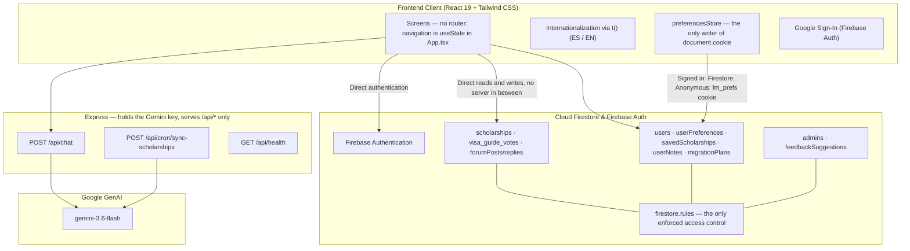

# LatinoMigra 🌍🎓

[](https://github.com/users/ana-izaguirre/projects/4)
[](./LICENSE)
[](https://github.com/ana-izaguirre/latino-migra/actions/workflows/ci.yml)
[](https://github.com/ana-izaguirre/latino-migra/actions/workflows/ci.yml)
[](https://vercel.com/)
[](https://react.dev/)
[](https://firebase.google.com/)
[](https://ai.google.dev/)
[](https://vitest.dev/)
[](https://playwright.dev/)

> **Languages:** **English 🇬🇧** | [Español 🇪🇸](./README.es.md)

> ⚠️ **Status: active development.** The product is usable but still
> changing — screens, data shapes and Firestore rules are not yet stable.
> Work is tracked issue by issue on the
> [**Product Engineering** project board](https://github.com/users/ana-izaguirre/projects/4),
> which is the roadmap: what is queued, in progress and done. Open issues
> live in [Issues](https://github.com/ana-izaguirre/latino-migra/issues).

---

### Project Overview
**LatinoMigra** is a comprehensive web platform created for Latin American students and professionals migrating to Spain, Europe, and North America for university degrees, master's programs, language courses, or vocational training.

### What is on screen today

The product has been deliberately narrowed. Six screens exist in the tree and
still compile, but nothing in the navigation links to them — the source of
truth is `HIDDEN_TABS` in
[`src/lib/navigation.ts`](./src/lib/navigation.ts), and restoring one is
deleting a line there.

| Screen | Status | What it does |
| :--- | :--- | :--- |
| **Scholarships & Studies** | ✅ Live | Verified calls and study programmes, filtered by origin, destination and level (Fundación Carolina, DAAD, Erasmus+, AUIP, Santander). Saved items split into their own sub-tabs. |
| **Migration guides** | ✅ Live | Per-country visa guides with requirements, costs and links to the official consular source. |
| **AI assistant** | 🚧 In progress | Gemini behind a server-side proxy, answering on visas, insurance, homologation and cost of living. Reachable, still being worked on. |
| Budget calculator | ⛔ Not linked | Monthly housing, food, transport and insurance by city. |
| Migration planner | ⛔ Not linked | Step-by-step roadmap before, during and after the move. |
| Community forum | ⛔ Not linked | Firestore-backed threads with cursor pagination and duplicate detection. |
| Consulate directory | ⛔ Not linked | Consulates and embassies with official appointment links. |
| Volunteering | ⛔ Not linked | Volunteering and exchange placements. |
| Suggestions hub | ⛔ Not linked | Reader submissions awaiting verification. |

Everything above ⛔ is built but not offered, so treat this table rather than
the file tree as the answer to "what can a visitor actually use".

---

### Architecture



The browser talks to Firestore directly, so `firestore.rules` is the only
enforced access control — there is no server-side validation layer. In
production Express serves `/api/*` only; the HTML and assets come from
Vercel's CDN. Details in [`docs/architecture.md`](./docs/architecture.md).

---

### How it was built

The project moved from picture to product in three stages, and the tooling
changed at each one.

**1. Prototyping — Google Stitch.** The first screens were generated as
prototypes in [Google Stitch](https://stitch.withgoogle.com/), which settled
layout, navigation and visual language before any component existed. Nothing
from Stitch ships; it decided what to build.

**2. First implementation — Google AI Studio.** The prototypes became a
running React application with [Google AI Studio](https://aistudio.google.com/).
That stage also chose the runtime the product still uses: Gemini behind a
server-side proxy, so the API key never reaches the browser.

**3. Ongoing engineering — Claude as the coding assistant.** Feature work,
refactors, tests and reviews are done with [Claude](https://claude.ai/code),
which is how most commits in this repository are authored. Every change is
still opened as a pull request and reviewed before it lands.

#### Context engineering, not prompting

The practice that makes stage 3 workable is **context engineering**: the
assistant's context is a maintained part of the repository rather than
something retyped into a chat box each session.

| What holds the context | What it carries |
| :--- | :--- |
| [`CLAUDE.md`](./CLAUDE.md) | The operating manual — non-negotiable constraints, workflow, definition of done. Rules only; it does not explain the system. |
| [`docs/`](./docs/README.md) | How the system actually works, split by concern: architecture, data, security, testing, accessibility, deployment. |
| [`specs/`](./specs) | A written specification per non-trivial feature: problem, goals, non-goals, acceptance criteria, edge cases. |
| GitHub Issues | The unit of work, each carrying an **AI Autonomy** level that bounds what the assistant may do — from *Human Only* (analysis, no code) to *Implement + Test + Review*. |

Two rules do most of the work. Constraints are written down at the point they
were violated, so each past defect becomes a rule that prevents its own
recurrence — the repository's guardrails were derived from its bugs, not
guessed in advance. And the assistant is told which sources to trust and in
what order: running code first, then tests, then specifications, then
documentation, then the issue, and its own inference last, always labelled as
an assumption.

Full rules: [`CLAUDE.md`](./CLAUDE.md) · Contribution workflow:
[`CONTRIBUTING.md`](./CONTRIBUTING.md)

### Development & Testing

```bash
# Install dependencies
npm install

# Run local development server
npm run dev

# Run TypeScript Lint check
npm run lint

# Run fast Vitest unit tests (<2 seconds)
npm run test:unit

# Run End-to-End tests (Playwright - Chromium default)
npm run test:e2e

# Build production bundle
npm run build

# Start production server
npm start
```

---

### Deployment on Vercel & Environment Variables

To protect credentials from being committed to Git, configure the following **Environment Variables** in your Vercel Dashboard (**Project Settings ➔ Environment Variables**):

| Variable | Description | Scope |
| :--- | :--- | :--- |
| `GEMINI_API_KEY` | Google Gemini API Key | Server-side only |
| `CRON_SECRET` | Shared secret guarding `POST /api/cron/sync-scholarships`. Without it the route rejects every request. | Server-side only |
| `VITE_FIREBASE_API_KEY` | Firebase API Key | Frontend (Vite) |
| `VITE_FIREBASE_AUTH_DOMAIN` | Firebase Auth Domain (`*.firebaseapp.com`) | Frontend (Vite) |
| `VITE_FIREBASE_PROJECT_ID` | Firebase Project ID | Frontend (Vite) |
| `VITE_FIREBASE_STORAGE_BUCKET` | Firebase Storage Bucket | Frontend (Vite) |
| `VITE_FIREBASE_MESSAGING_SENDER_ID` | Firebase Messaging Sender ID | Frontend (Vite) |
| `VITE_FIREBASE_APP_ID` | Firebase Web App ID | Frontend (Vite) |
| `VITE_FIREBASE_DATABASE_ID` | Firestore Database ID (optional if default) | Frontend (Vite) |

---

### License

Released under the [MIT License](./LICENSE).
