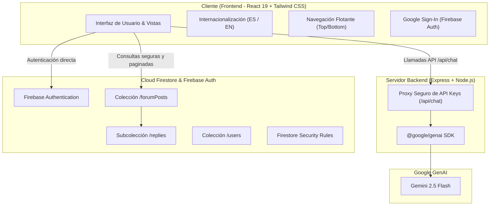

# LatinoMigra 🌍🎓

[](https://github.com/ana-izaguirre/latino-migra/actions/workflows/ci.yml)
[](https://github.com/ana-izaguirre/latino-migra/actions/workflows/ci.yml)
[](https://vercel.com/)
[](https://react.dev/)
[](https://firebase.google.com/)
[](https://ai.google.dev/)
[](https://vitest.dev/)
[](https://playwright.dev/)

> **Idiomas / Languages:** **Español 🇪🇸** | [English 🇬🇧](./README.en.md)

---

## 🇪🇸 Descripción del Proyecto

**LatinoMigra** es una plataforma web integral diseñada para estudiantes y profesionales latinoamericanos que desean migrar a España, Europa o Norteamérica para cursar estudios de grado, máster, cursos de idiomas o formación técnica.

### 🚀 Módulos Principales
1. **🎓 Explorador de Becas y Ayudas**: Buscador con filtros por país de origen, destino y nivel educativo (Fundación Carolina, DAAD, Erasmus+, AUIP, Santander, etc.).
2. **🤖 Asistente de IA con Gemini**: Respuestas al instante sobre visados de estudiante, seguros médicos homologados, equivalencias y coste de vida.
3. **💬 Comunidad y Foros en la Nube**: Desarrollado con **Cloud Firestore**, con paginación optimizada por cursores, detección de dudas duplicadas y respuestas por hilo.
4. **💰 Calculadora de Presupuesto**: Estimador mensual con desglose de alojamiento, manutención, transporte y seguro según la ciudad.
5. **🗺️ Planificador y Hoja de Ruta**: Cronograma interactivo con pasos antes, durante y después del viaje.
6. **📍 Directorio de Consulados y Embajadas**: Ubicación de representaciones consulares con enlaces directos a citas oficiales.
7. **🔔 Centro de Alertas y Notificaciones**: Recordatorios de plazos de convocatorias, cambios de extranjería y notificaciones push.

---

## 🏗️ Arquitectura Técnica



---

## 💻 Desarrollo y Pruebas

```bash
# 1. Instalar dependencias
npm install

# 2. Iniciar servidor de desarrollo local (Express + Vite)
npm run dev

# 3. Validar TypeScript y estilo
npm run lint

# 4. Ejecutar pruebas unitarias ultra rápidas (Vitest)
npm run test:unit

# 5. Ejecutar pruebas End-to-End (Playwright - Chromium rápido)
npm run test:e2e

# 6. Compilar para producción
npm run build

# 7. Iniciar en producción
npm start
```

---

## 🚀 Despliegue en Vercel y Variables de Entorno

Para evitar exponer credenciales o archivos de configuración en tu repositorio Git, configura las siguientes **Environment Variables** en el panel de Vercel (**Project Settings ➔ Environment Variables**):

| Variable | Descripción | Ámbito |
| :--- | :--- | :--- |
| `GEMINI_API_KEY` | Clave de API de Google Gemini (Servidor) | Backend / Servidor |
| `VITE_FIREBASE_API_KEY` | Clave API de tu proyecto Firebase | Frontend (Vite) |
| `VITE_FIREBASE_AUTH_DOMAIN` | Dominio de Auth de Firebase (`*.firebaseapp.com`) | Frontend (Vite) |
| `VITE_FIREBASE_PROJECT_ID` | ID de tu proyecto de Firebase | Frontend (Vite) |
| `VITE_FIREBASE_STORAGE_BUCKET` | Bucket de almacenamiento de Firebase | Frontend (Vite) |
| `VITE_FIREBASE_MESSAGING_SENDER_ID` | Sender ID de mensajería Firebase | Frontend (Vite) |
| `VITE_FIREBASE_APP_ID` | App ID web de Firebase | Frontend (Vite) |
| `VITE_FIREBASE_DATABASE_ID` | ID de base de datos Firestore (opcional si es default) | Frontend (Vite) |

> 🔒 **Seguridad**: El archivo `firebase-applet-config.json` y los `.env` locales están en `.gitignore` para garantizar que nunca se suban credenciales a GitHub.
